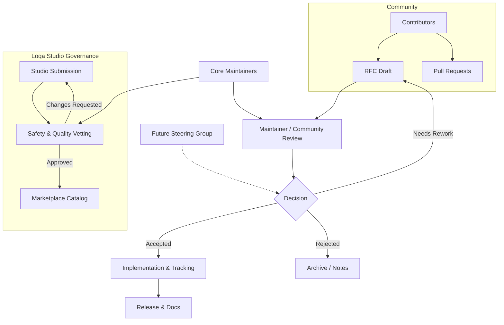

# Governance Structure

## Roles & Responsibilities
- **Contributors** – draft RFCs, submit code/docs, share Studio add-ons.
- **Maintainers** – steward the roadmap, review RFCs, approve marketplace entries during the bootstrap phase.
- **Future Steering Group** – will be established to share decision-making once the community grows; today it’s represented by maintainers.

## Processes
- **RFC Flow:** Submission → Discussion/Review → Decision → Implementation → Release.
- **Marketplace Flow:** Submission → Vetting (quality, security, ethics) → Catalog publication.

See also:
- [Governance overview](README.md)
- [Licensing philosophy](licensing.md)
- [Privacy principles](privacy.md)
- [Marketplace guidelines](../studio/README.md)
