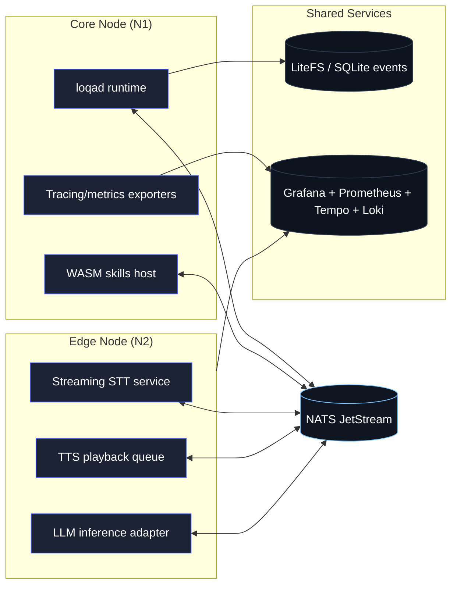

# Workstream E – Internal Dogfooding Cluster Plan

Issue reference: [loqa-meta#14](https://github.com/loqalabs/loqa-meta/issues/14)

## Objectives
- Exercise nightly builds in a realistic, always-on environment prior to external releases.
- Validate latency, stability, and skill execution across heterogeneous hardware.
- Capture structured feedback and telemetry to close the loop with engineering and roadmap decisions.

## Target Topology

- **Node 1 (Core):** macOS/mac mini class machine running `loqad`, skills host, event store, and observability stack via Docker Compose.
- **Node 2 (Edge):** Linux SBC (Jetson Orin / Raspberry Pi 5) hosting STT (Whisper/faster-whisper), TTS (Kokoro), and LLM adapter (Ollama or llama.cpp build).
- **Network:** Wired LAN preferred, static IPs or DHCP reservations, private VLAN if possible. All services communicate via NATS over TLS.

## Hardware & OS Baseline
| Component | Minimum spec | Notes |
| --- | --- | --- |
| Core node | Apple Silicon Mac mini (8c CPU / 16 GB RAM) or equivalent x86 workstation | Runs runtime + observability containers. Requires Docker Desktop or Colima. |
| Edge node | Raspberry Pi 5 (8 GB) or Jetson Orin Nano (8 GB) | GPU/NPU acceleration preferred for Whisper; Ubuntu 24.04 or NVIDIA JetPack. |
| Network | Gigabit switch, VLAN support optional | Low latency between nodes; consider PoE for Pi. |

## Software Components
- **Runtime bits:** Nightly `loqa-core` bundles (tarballs) deployed via automation.
- **Message bus:** NATS 2.10+ with JetStream, running on core node (systemd service or container).
- **Observability:** Grafana/Prometheus/Tempo/Loki stack from `loqa-core/observability` compose file.
- **Skill packages:** Timer + smart-home examples plus at least one “real” automation (e.g., Home Assistant bridge running against test environment).
- **Synthetic load tools:** CLI scripts to publish NATS events and replay transcripts.

## Provisioning Strategy
1. **Configuration management:** Use Ansible playbooks to ensure idempotent setup on both nodes (users, packages, directories, systemd units).
   - Playbook roles: `common`, `nats`, `loqad`, `observability`, `stt`, `tts`, `ollama`.
2. **Artifact distribution:** Pull latest nightly tarballs via GitHub CLI token or curl + PAT. Verify checksum before install.
3. **Secrets handling:** Store tokens and credentials in 1Password and inject into Ansible via env vars. Generate NATS creds for inter-node auth.
4. **Service definition:** Prefer systemd units for long-running binaries (loqad, stt, tts). Use Docker Compose for observability stack only.
5. **Rollback:** Keep previous nightly bundle under `/opt/loqa/releases/<date>` with symlink for active version.

## Observability & Telemetry
- Enable OTLP exporters to Tempo/Grafana on the core node; expose dashboards for latency (`loqa.voice_latency_ms`), error rates, skill invocations.
- Configure Prometheus alerts (or Grafana alert rules) for:
  - NATS disconnects / reconnection loops
  - STT/LLM/TTS queue backlog > threshold
  - Voice latency P95 > 250 ms
- Ship logs via Loki; tag by node + service.

## Operations & Maintenance
- **Update cadence:** Nightly job pulls new bundle, runs smoke tests, and flips symlink on success. Keep previous build for quick rollback.
- **Rotation schedule:** Weekly manual review of dashboards, monthly rehearsal of disaster recovery (restart nodes, NATS failover).
- **Feedback loop:** Log issues/findings in a dedicated GitHub Discussion category (`Dogfooding reports`) and link to tickets.
- **Security:** Apply OS updates monthly, rotate NATS credentials quarterly.

## Validation Plan
1. **Smoke tests (post-deploy):**
   - `loqa-skill validate` on installed manifests.
   - Publish timer command; expect status + TTS events.
   - Trigger synthetic voice transcript; verify TTS audio frames and latency metrics.
2. **Synthetic workload:** Cron-driven script sends intent mix (timers, lights, small talk) every 10 min during idle hours.
3. **Manual scenarios:** Weekly scenario runbook (multi-step automation, failure injection such as killing STT process to validate recovery).

## Deliverables & Task Breakdown
1. **Topology & provisioning design doc** (this doc) ✅
2. **Ansible/playbook scaffolding**
   - Common role: packages, users, directories
   - Core node roles: NATS, loqad, observability
   - Edge node roles: STT, TTS, LLM
3. **Secrets & credentials setup**
   - NATS account/creds
   - GitHub PAT for artifact download
4. **Deployment automation**
   - Nightly bundle fetch + install script with checksum verification
   - Systemd unit files + templates
5. **Telemetry dashboards & alerts**
   - Grafana dashboards, Prometheus rules
6. **Synthetic workload scripts**
   - CLI or Go-based generator sending NATS events
7. **Runbook & feedback process**
   - Markdown doc covering operations, maintenance schedule, escalation path

Each item above should be tracked as sub-issues under loqa-meta#14 and corresponding repos (`loqa-core`, `loqa-site`, or infrastructure repo when created).

## Risks & Mitigations
| Risk | Impact | Mitigation |
| --- | --- | --- |
| Edge hardware underperforms for real-time STT | Latency regressions go unnoticed | Benchmark with Whisper variants, consider Jetson GPU or offload to core node if needed. |
| Nightly bundles break services | Dogfood cluster downtime | Keep previous bundle for rollback; include canary smoke tests before symlink update. |
| Telemetry noise overwhelms storage | Hard to interpret metrics | Set retention (7 days for high-volume logs), downsample metrics where possible. |
| Secrets sprawl | Security incident | Centralize credentials, automated rotation reminders. |

## Next Steps
- Convert deliverables into GitHub issues with owners and estimated timelines.
- Align provisioning approach with any broader infrastructure standards (e.g., macOS management, Pi imaging).
- Schedule kickoff session to assign work and target completion before external alpha recruitment.
